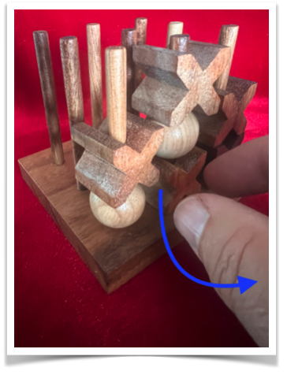
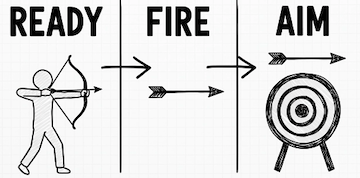

# Collapse3



*This is **not** 3D tic-tac-toe. The 3×3×3 geometry is familiar; the rules and state dynamics are not ([why?](docs/FAQ.md#18-is-collapse3-just-a-more-complicated-version-of-3d-tic-tac-toe)).*

> Collapse3 is a microscope for AI evaluation. The failure modes it reproduces
> are not hypothetical — exploitable champions, sandbagging, and networks that
> generalize yet collapse under adversarial pressure have all been documented in
> real AI systems. What this tiny, exactly-solved 3×3×3 game adds is proof: here,
> win rate, Elo, held-out accuracy, and regret are checked directly against
> ground truth, and the failures ordinary scoreboards miss are certified, not
> estimated — including a rated champion that outranks a perfect player it never
> once beat, while a proof shows the champion itself is a forced loss.

Collapse3 is a tiny, perfect-information, deterministic 3×3×3 board game — and it
is **solved**: an exact solver ships in this repository. Yet it is complex enough
that teachable "basic strategy" runs out almost immediately (a compact rulebook
draws at the smallest board and is *certifiably* dead beyond it).

The repository's exact solver is pure Python (no dependencies). It isn't a
player here — it's an examiner: it grades every move against perfect play,
turning "how good is this agent?" into a number (**value-based regret**), and the
game into an instrument for measuring **competence**, not just performance.

**Is competence a property of the agent — or of the agent plus the opponents it
happens to face?** A one-ply agent posts its highest optimal-move rate (**78%**)
against the opponent it loses to **84%** of the time (and wins **0%**). In a
measured round-robin, **Elo ranks a certifiably exploitable rulebook above the
perfect player** ([Finding 10](docs/FINDINGS.md)). Because the ground truth is
exact, no opponent can make a bad move grade as good and no thrown game grades
clean — surrendered value always logs as regret ([Finding 9](docs/FINDINGS.md)).
What an opponent *can* still shape is which states get visited — which is why
every average we report names its distribution.

In large systems we watch agents fail and wonder why. In Collapse3 we can measure
*exactly why* — and **unit-test proposed evaluation methods against ground truth**
before trusting them on systems you cannot solve. It aims to be a small,
reproducible exhibit of the failure modes — distribution-dependent competence,
representation gaps, brittle plans, sandbagging — that AI safety and evaluation
researchers care about, measured exactly rather than estimated.

*Why care about a solved toy game? The standing objection — and the transfer
test that says exactly when a finding here licenses a claim about a real system —
is answered in [`RELEVANCE.md`](RELEVANCE.md): the toy is not a model of your
system, it is a unit test of your metric, run where the answer key exists.*

*New to the game? The rules fit in ten lines — see [The game](#the-game) below
(full rules: [`rules.md`](rules.md)). Enough to read the findings: players
**place** beads from a limited **reserve** onto a 3×3 grid of 3-deep pegs, or
**remove** an opponent bead — destroying it and dropping everything above it —
to make three-in-a-row anywhere in the cube.*

## In this README

1. **[Frozen plans vs. re-solving](#frozen-plans-vs-re-solving)** — an open-loop oracle plan loses to blunders; re-solving does not.
2. **[Teachable strategy runs out](#teachable-strategy-runs-out)** — a compact rulebook draws at (3,3) and is certifiably dead beyond it.
3. **[Representation floors (by interface)](#representation-floors-by-interface)** — the same missing feature has different exact prices depending on what the agent sees.
4. **[Sandbagging is hard](#sandbagging-is-hard)** — you cannot force your own loss; the oracle audits thrown value, not intent.
5. **[Self-play coverage decays](#self-play-coverage-decays)** — on-policy near-perfect play can still walk off a certified cliff.
6. **[Generalization is not robustness](#generalization-is-not-robustness)** — a net that generalizes (~98% on unseen states) is still a certified forced loss.
7. **[The strongest player is not the strongest tester](#the-strongest-player-is-not-the-strongest-tester)** — an evaluator using only optimal opponents leaves a certified forced loss compatible.
8. **[The game](#the-game)** — rules in ten lines.
9. **[Docs & LLM context](#docs--llm-context)** · **[Reproduce](#reproduce)** · **[Citation](#citation)**

## Frozen plans vs. re-solving

From a **drawn** position, a *frozen* exact-oracle plan loses **15 of 32**
opponent blunder-lines (and wins 0); a player that **re-solves** each move loses
0 and wins 23. A deliberately *worse* move beats the oracle-derived plan —
because the plan was a best-response to one line, not a strategy. Win rate hides
this completely.

## Teachable strategy runs out

*A compact set of rules you can teach provably runs out here: it works at the
smallest board and is exactly refuted beyond it, so competence becomes a
calculation, not a rule.*

Most games have a *strategy ladder* — a simple positional heuristic gets a
beginner to coherent play. In Collapse3 the ladder has exactly one known rung.
The *intuitive* rule ("build your own lines") is optimal on **0%** of the
decisive moves and loses **99%** of a game it should draw — gravity-and-removal
turns greed into suicide. Even a one-ply agent with a *good* positional
evaluation still **loses 64%** of that drawn game; a single extra ply lifts the
same evaluation to near-perfect (critical-decision accuracy **0.62 → 0.997**).

Then someone proposed an actual rulebook, and we could *prove* things about it.
An externally proposed five-line strategy (place centre → corners → edges,
block, remove only to win) is a **certified exact drawing policy at (3,3)** —
both seats, against every possible opponent, by exhaustive best-response solve.
From **(4,4) up, every formalization of it is a certified forced loss** (both
seats). The teachable game is real, and it ends at (3,3): beyond that, for
every rulebook tested so far, competence is bought in plies of search, not in
rules you can write down — a conjecture with two certified refutations behind
it, not a theorem, and the best-response solver
([`experiments/best_response.py`](experiments/best_response.py)) will grade any
new candidate exactly.

The evaluation moral is the sharpest part: that same rulebook survived **1,199
of 1,200 games** against a strong noisy opponent — while carrying a **5-ply
forced refutation** the exact solve finds in ~0.03 seconds. Playing lots of
games, the way most agents are evaluated, missed the shallowest possible kill
([Finding 8](docs/FINDINGS.md)).

## Representation floors (by interface)

A floor is not a property of a game or an agent. The **same** missing feature
(the reserve count) costs a ladder of different *exact* amounts depending on
what the policy sees — at (4,4):

| what the policy sees | exact cost |
|---|---|
| board + cooldown only (reserve fully aliased) | **0.0805** |
| + the legal-move list (the interface our trained agents actually had) | **0.0026** |
| + destroyed-bead memory (reserves reconstructed) | **0.0000** |
| ⟶ its own on-policy trajectory (ε-optimal opponent) | ~0.0013 *(not a floor)* |

We priced the first rung; our agents lived on the second; realized on-policy
regret is a third, opponent-dependent quantity again. Only measuring all of them
showed which number was honest — the exact failure mode of real evaluation:
*the bound you prove is for the system you modeled, not the one you shipped*
(Findings 4 and 7).

The mask-blind rung (board + cooldown only) is the clean theoretical anchor;
across the two full-board sizes we can enumerate it *rises* (0.08 at (4,4) →
**0.17** at (5,5)) — structural, not small-game triviality — and the sibling
geometries map its full shape where the 27-cell board is out of reach
([Findings 12–13](docs/FINDINGS.md)). But it is *not* the interface anyone shipped a trained
agent under: give the policy the legal-move list and the mask leaks state
(removals reveal cooldown; missing placements reveal an empty reserve), the
reserves floor collapses ~30–70× — and that **shipped** (mask-aware) floor
**declines** slightly over the same interval (0.0026 → 0.0024). Same missing
feature, **opposite scaling signs**. Every method that appears to "beat" the
floor works by putting the missing information back. Details in
[`docs/FINDINGS.md`](docs/FINDINGS.md).

Collapse3 is an exact, game-based demonstration of the memoryless-policy problem
Littman (1994) formalized. That such policies pay a floor under aliased
observations is classical (Whitehead & Ballard 1991; Littman 1994; Singh,
Jaakkola & Jordan 1994); what Collapse3 adds is the *exact*, enumerated value of
that floor **per interface** in a natural, fully solved game — not a worst-case
bound — and a constructive recovery to a **0.0000** floor from remembered game
history.

Collapse3 is a deterministic, perfect-information game turned into an instrument
for studying partially observable decision-making: restricting what an agent
observes induces a POMDP for that agent — but inside a fully solved game, so the
evaluator keeps exact ground-truth values and every decision is graded. The cost
of a missing feature becomes a number you *enumerate*, not one you estimate.

The game gets *sharper* as it grows, not drawish: the drawn fraction falls
**86% → 72% → 54% → 38%** from (2,2) to (5,5), and equal reserves — a draw
through (5,5) — become a **first-player line win at (6,6)**, extending through
the full **14-bead game** (Finding 11). Scale the reserves, not the rules, if
you want a less drawish game. Move order and material decide the opening
exactly, which is why win rate needs the oracle to deconvolve it. Details in
[`docs/FINDINGS.md`](docs/FINDINGS.md).

## Sandbagging is hard

Deliberate underperformance is structurally resisted here. We solved the misère
question exactly: a player who *wants* to lose **cannot force the opponent to
win** at any solved size ((3,3)–(5,5)), from either seat — he can force never
*winning* (accept a draw), but the opponent can always escape a forced loss.
Against a random opponent a perfect thrower can raise the opponent's win chance
steeply with size (**31% → 55% → 80%** moving first) — but never to 100%:
forcing your own loss is impossible at every solved size. What a regret audit
sees is two-sided, and exactly measurable: *realizing* a worse outcome than the
position warrants always logs positive regret, but a thrower can **steer inside
the set of optimal moves for free** — at (3,3) all nine openings are zero-regret,
yet they differ in how likely the fallible opponent is to end up winning, and
the oracle cannot see that choice. The oracle audits thrown *value*, not thrown
*intent*. Or, concretely: a grandfather provably cannot guarantee his grandson
wins ([Finding 9](docs/FINDINGS.md)).

## Self-play coverage decays

*The same evaluation blind spot, now with a learned agent that never saw the
solver.* On an exactly-solvable **sibling** of the game (three pegs; a parallel
environment, never a claim about Collapse3), a **true self-play** agent — one
shared brain playing both seats, learning only from who won — becomes
near-perfect **on its own trajectories** (~0.045 regret) and *stays* there as
the game grows. Graded over the *whole* game by the exact solver — against a
random-policy baseline, so the number has a scale — its edge **erodes**: it
removes two-thirds of a random agent's mistakes at the small end but under half
at the largest size, having ever visited only **42%** of the positions. Sharp
where it plays, fading off its lines — and on-policy scores alone would never
show it. Freezing that "undefeated"
policy, an exact best-response forces it off its winnable game in **2 of 5**
runs at the largest size — a flat self-play record is not robustness. And the
sharpest failure is distribution shift: trained where the centre opening
*uniquely wins*, **all five** runs learn "play centre" and carry it across the
enumerated phase boundary into a size where the centre **loses** — provably
optimal in training, fatal one reserve later ([Finding 14](docs/FINDINGS.md)).

## Generalization is not robustness

*A learned model can generalize and still be exactly exploitable — a torch-based
exhibit, not a claim about frontier systems.*

The natural rebuttal to everything above is: sure, a *frozen plan* or a
*hand-written rulebook* is brittle, but a real *learned* model would generalize
and be fine. So we trained one — a small neural net on exact solver labels — and
it **does** generalize: **~98%** optimal on held-out (4,4) states it never saw
(0.933 even at a 0.5%, leakage-light train fraction; 0.923 extrapolating to a
larger (5,5) board). By every average-case test, it learned the game. Handed to
the exact best-response solver, **all six** trained policies (two architectures ×
three seeds) are nonetheless a **certified forced loss from both seats** — twelve
certifications, twelve forced losses — in ≤6 plies — the adversary wins by playing deliberate blunders that only work against
that particular net. A near-zero generalization gap certifies *nothing* about
worst-case robustness: the failure is not in the distribution, it is in what an
adversary can steer toward. **Performance is not competence; generalization is
not robustness.** (A torch-dependent exact exhibit at (4,4) with small MLPs, not
evidence about large models — [Finding 16](docs/FINDINGS.md), full writeup
[`docs/NEURAL_EXHIBIT.md`](docs/NEURAL_EXHIBIT.md).)

## The strongest player is not the strongest tester

*Every result above grades an agent. This one grades the **evaluation** — and it
is exact, pure-Python, no neural nets.*

Choosing an opponent for evaluation isn't just choosing a difficulty level — it's
choosing which states will ever be scrutinized. Choose a perfect opponent and you
are, provably here, choosing to leave the very states that would expose a
catastrophic weakness unvisited.

After a candidate passes an evaluation, how bad can a policy still be while
remaining consistent with everything the evaluation observed? Pin the candidate
to perfect play wherever the evaluation looked, free it everywhere else, and
best-response solves the exact **compatible outcome range**. The result: an
evaluator that tests only against **optimal** opponents can inspect as few as
**10 decisions at (4,4)** and certify *nothing* — a policy that passes it
perfectly is still a **certified forced loss** — while the same protocol against
**all-legal** opponents rules the loss out. Seat-0-only at (3,3), **two-sided at
(4,4)**: it grows with the board. A perfect opponent refuses to enter the
objectively-losing lines where the candidate's weakness lives, so **opponent
strength and evaluator strength are different properties**. And strategic
coverage buys nothing over same-universe random — it's the universe, not the
selection (H2 falsified). Details in [`docs/FINDINGS.md`](docs/FINDINGS.md)
([Finding 17](docs/FINDINGS.md)) and [`docs/EVALUATION_EQUIVALENCE.md`](docs/EVALUATION_EQUIVALENCE.md).

## The game



Ready, fire, aim. Most games are ready, *aim*, fire. Collapse3 is ready, *fire*,
aim: you commit a bead before the board has decided what it's worth. Pull a bead
out and everything above it drops a level — so a piece you placed earlier can
fall into a different line, or out of the one you meant. And the only beads you
can pull are your opponent's: you play inside their position, not just your own.

**Rules in ten lines.** The board is a 3×3 grid of pegs, each holding up to 3
beads; each player starts with a **reserve** of beads (14 in the full game;
`(r, r)` in the experiments). On your turn you do exactly one thing:

- **Place** a bead from your reserve on any non-full peg — it falls to the
  lowest empty level; or
- **Remove** one *opponent* bead ("the Collapse") — legal only from a peg that
  is tied-tallest, holds 2+ beads, and is *opponent-topped*, and never on two
  of your consecutive turns (**cooldown**). The bead is destroyed — it returns
  to no one — and everything above it drops one level (**gravity**).

First to line up three of their beads wins — vertical on one peg, flat on any
level, or a staircase across three collinear pegs. If your removal's gravity
cascade completes a line for your *opponent*, they win instantly (the **Oops
rule**). When both reserves are empty, or the player to move has no legal
action, the game ends immediately and most surviving beads on the board wins
(**attrition**); equal count is a draw.

So the top of the board isn't the whole story: buried beads, reserve counts, and
last turn's cooldown decide the game too. Even chess hides a little history in
its state — castling rights, en passant, the fifty-move counter — none of it
visible in a bare snapshot; Collapse3 just makes that gap **load-bearing**, which
is exactly why a lossy view of the state carries an irreducible cost (see the
floor above). Full rules (singleton immunity, simultaneous wins, end-of-game
priority) in [`rules.md`](rules.md).

## Docs & LLM context

- **Findings & significance:** [`docs/FINDINGS.md`](docs/FINDINGS.md)
- **FAQ** (is this a POMDP? you solved it — so what's the strategy? why not
  Elo? is AI "hitting a wall"?): [`docs/FAQ.md`](docs/FAQ.md)
- **In a nutshell:** [`NUTSHELL.md`](NUTSHELL.md)
- **Why care? (the transfer test):** [`RELEVANCE.md`](RELEVANCE.md)
- **Ask an LLM about this repo:** paste [`llms-full.txt`](llms-full.txt) (the
  entire project in one file) into any chat model. Index: [`llms.txt`](llms.txt).

## Reproduce

```bash
pip install -e ".[dev]" && pytest
python -m experiments.aliasing_floor 4        # any experiment writes results/<name>.json
pytest tests/test_reference_engine.py       # clean-room rules cross-check (~5s)
```

```
collapse3/   engine + solver + oracle + agents + learning + metrics
experiments/ provenance-stamped studies (python -m experiments.<name>)
results/     outputs with the git commit, config, and seed that produced them
```

## Citation

If you use Collapse3, please cite it:

```bibtex
@misc{mccormack2026collapse3,
  author       = {McCormack, Rob},
  title        = {Collapse3: measuring competence vs. performance with an exact game oracle},
  year         = {2026},
  howpublished = {\url{https://github.com/Rob-McCormack/collapse-3}}
}
```
